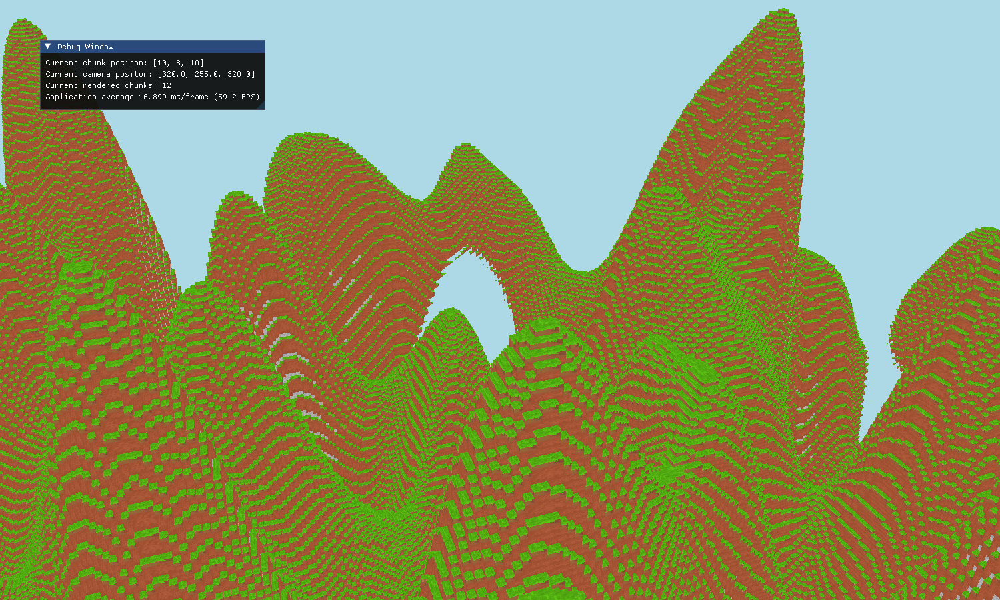
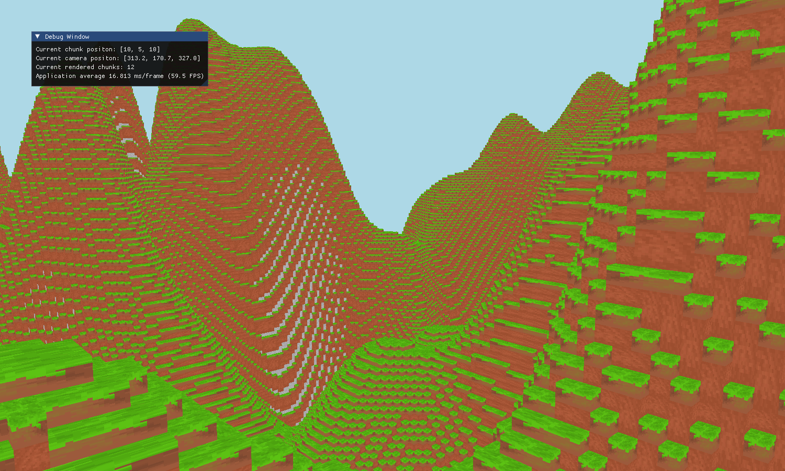

# Voxel Engine Project

## Overview

This project is a 3D terrain renderer optimized with techniques like face culling, instancing, and greedy meshing. It efficiently renders voxel-based worlds with high performance and visual fidelity. Additionally, it includes a terrain generation system using FastNoiseLite for procedural landscapes.

## Features

- **3D Chunk Rendering**: Efficient rendering of large voxel-based worlds.
- **Instancing**: Reduces the number of draw calls for improved performance.
- **Face Culling**: Optimizes rendering by skipping hidden faces.
- **Greedy Meshing**: Minimizes geometry for better rendering performance.
- **Procedural Terrain Generation**: Generates diverse and interesting landscapes using FastNoiseLite.
- **Cross-Platform Support**: Designed to run on both Linux and Windows systems.
- **OpenGL Integration**: Utilizes modern OpenGL for rendering.

## Project Structure

```
project/
├── build/
│   ├── linux/
│   ├── win/
├── src/
│   ├── core/
│   │   ├── Application.cpp
│   │   ├── Application.hpp
│   │   ├── InputHandler.cpp
│   │   ├── InputHandler.hpp
│   ├── external/
│   │   ├── glad/
│   │   ├── glfw/
│   │   ├── glm/
│   │   ├── imgui/
│   ├── graphics/
│   │   ├── Renderer.cpp
│   │   ├── Renderer.hpp
│   │   ├── Shader.cpp
│   │   ├── Shader.hpp
│   │   ├── stb_image.c
│   │   ├── stb_image.h
│   │   ├── Texture.cpp
│   │   ├── Texture.hpp
│   ├── res/
│   ├── shaders/
│   │   ├── fs.glsl
│   │   ├── vs.glsl
│   ├── terrain/
│   │   ├── Chunk.cpp
│   │   ├── Chunk.hpp
│   │   ├── FastNoiseLite.h
│   │   ├── Terrain.cpp
│   │   ├── Terrain.hpp
│   ├── util/
│   │   ├── Camera.hpp
│   │   ├── Config.hpp
│   │   ├── FrameTimer.cpp
│   │   ├── FrameTimer.hpp
│   │   ├── Tick.cpp
│   │   ├── Tick.hpp
│   ├── CMakeLists.txt
├── .gitignore
├── README.md
```

## Dependencies

- **GLAD**: For loading OpenGL functions.
- **FastNoiseLite**: For terrain generation.
- **GLFW**: For creating windows and handling input.
- **GLM**: For mathematics operations (vectors, matrices, etc.).
- **CMake**: For building the project.

## Build Instructions

### Linux

1. Install dependencies:

   ```sh
   sudo pacman -S cmake glfw-x11 glm
   ```

2. Clone the repository:

   ```sh
   git clone https://github.com/lol-boi/Voxel-Lab.git
   cd Voxel-Lab
   ```

3. Build the project:

   ```sh
   mkdir build/linux
   cd build/linux
   cmake ../../src
   make
   ```

4. Run the executable:

   ```sh
   ./voxel_lab
   ```

### Windows

1. Install dependencies (e.g., via vcpkg or other package manager).

2. Clone the repository:

   ```sh
   git clone https://github.com/lol-boi/Voxel-Lab.git
   cd Voxel-Lab
   ```

3. Build the project:

   ```sh
   mkdir build/win
   cd build/win
   cmake -G "MinGW Makefiles" ../../src
   mingw32-make
   ```

4. Run the executable:

   ```sh
   ./voxel_lab.exe
   ```

## Usage

1. Execute the binary to start the voxel engine.
2. Use the WASD keys to navigate through the world.
3. Press the spacebar to go up and the mouse to look around.


## Screenshots

### 3D Terrain Rendering with Optimizations




## Acknowledgments
- **GLAD** for OpenGL function loading.
- **FastNoiseLite** for noise generation.
- **GLFW** for window and input management.
- **GLM** for mathematics operations.
